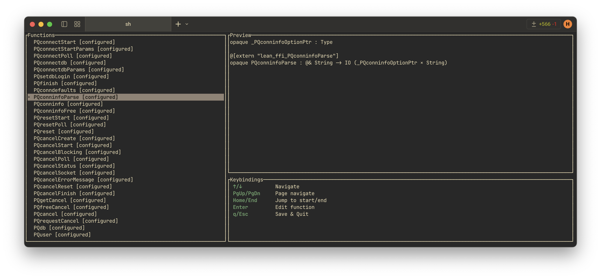
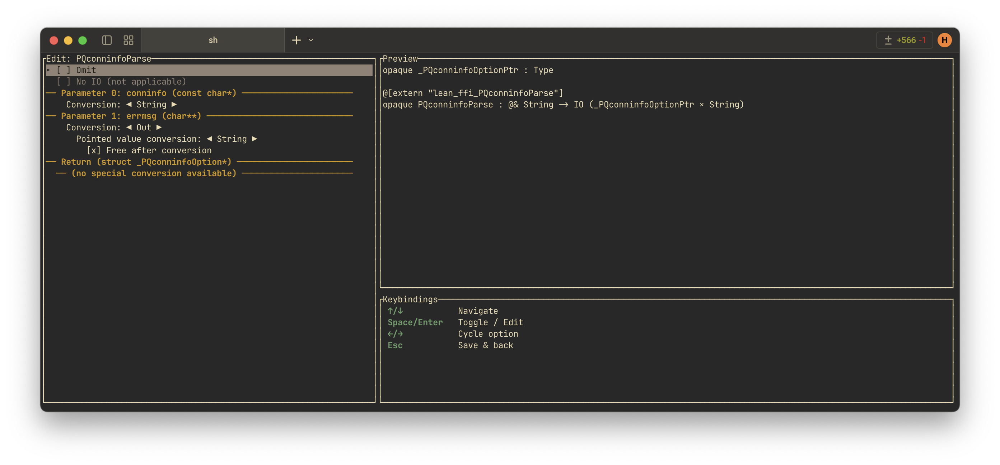

### Disclaimer: This was largely written by Github Copilot.

# Lean-C-Bridge

This is a tool for generating Lean FFI bindings based on declarations in a C header file (or source file without externally linked symbols). It parses the C file, extracts the functions and types, and generates a Lean module and a C source file that together allow you to call the original C functions from Lean.

The tool also contains a TUI for interactively customizing how to map the various C parameters and return types to Lean:

## Dependencies

- Rust 2024 (for building the tool)
- libclang (for parsing C code)
  - libclang is linked dynamically. See the documentation for `clang-sys` for details on how libclang is discovered at runtime: https://crates.io/crates/clang-sys/1.9.0

## Usage

For a pragmatic example of how to use the tool, see the `test` directory, which contains a sample C header file, a corresponding shell script for running the tool on it, pre-saved interface choices, and a Lean package that runs tests on the generated bindings.

For details on the command line options, run `cargo run -- --help`.